#  Premiere Pro

目前学习视频：[Bilibili](https://www.bilibili.com/video/BV1bb411F7Sh?p=2)

### 编辑流程

+ 创建工程（废话）
+ 导入素材到工程（视频、音频 etc.)
	+ 如果格式不支持，可以先用 FFmpeg 或 Media Encoder 先进行转码
	+ 不知道为什么，似乎 Media Encoder 和 Premiere Pro 对 flv 都束手无策，但可以使用 FFmpeg 或者 Adobe Animate（不会吧，不会吧，不会有人会为了处理 flv 安装这么大的软件把） 处理
	+ 对于 B 站视频，可以考虑下载 Dash 格式，分别导入 mp4 和 m4a
+ 创建序列（在 “文件-新建序列” 中）
	+ 所谓序列，也是一个文件，记载与时间轴相关内容，还包含视频格式，编码有关内容。
+ 导入素材到序列（可以拖动导入）
	+ 如果是导入视频，可以单独删掉视频的音轨或者画面 **(需要先取消链接)**
+ 运用各种工具进行粗剪（将不需要的部分裁剪掉）
	+ 可以利用多个序列进行此操作
	
	+ 可以利用`剃刀工具(C)` 将一个轨道分割为两个:e.g.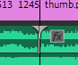
	
	+ 可以将分割后的部分轨道删除（记得备份序列）
+ 对视频进行微调，一般对视频的颜色和明暗程度进行调整
  + 选择在`效果`视图中的`颜色校正`，以三向颜色校正器(Lumetri颜色)为例，选择后再选择对应的轨道，切换到`效果控件`，即可进行调整 
  + 可以使用`调整图层`
    + 
    + 新建后可以拖动到序列的时间轴中，对效果进行编辑
+ 添加图形或字幕
### 常用属性
PrimerePro 在`编辑-首选项`中进行设置

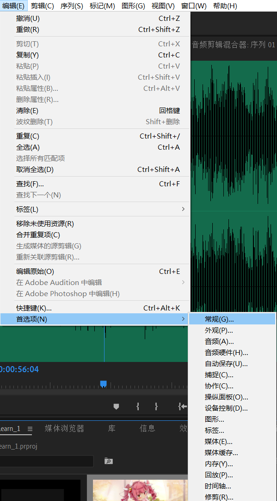

在文件菜单栏中也有项目设置：

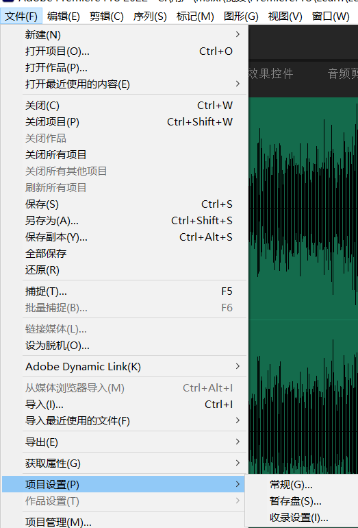

序列也可进行设置，首先选择一个序列，之后可以在序列菜单中进行设置

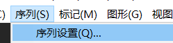

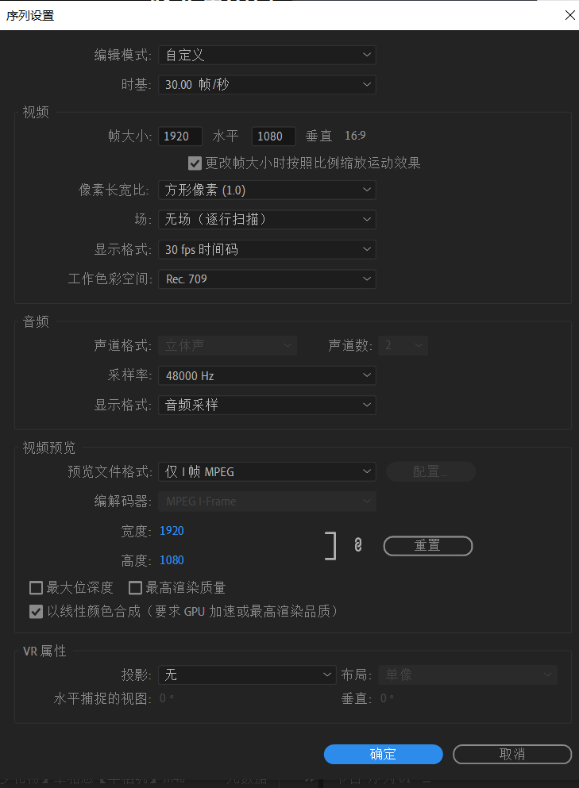

将视频拖动到序列上可以快速导入视频导入序列，此外还可以把序列拖动到序列上来创建子序列

界面窗口里的按钮可以进行编辑添加

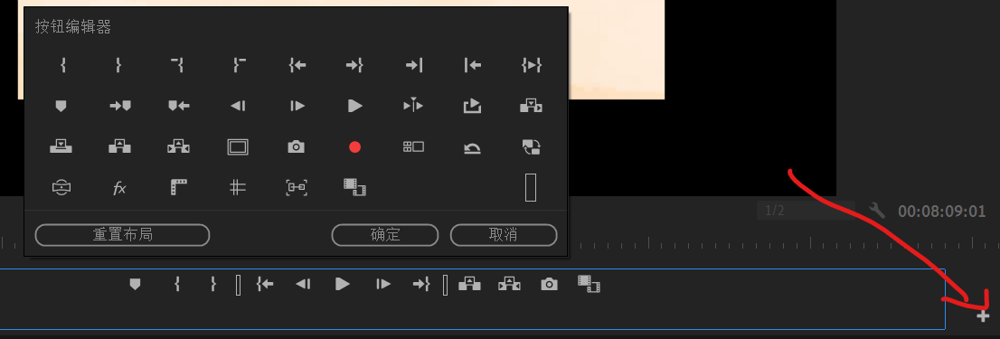

### 常用快捷键

+ <kbd>~</kbd> 将当前的视图在正常位置和最大化之间切换
+ <kbd>j</kbd> 后退
+ <kbd>l</kbd> 播放（前进)
+ <kbd>k</kbd> 暂停
+ <kbd>jj</kbd>加速后退
+ <kbd>ll</kbd> 快放
+ <kbd>i</kbd>添加入点（可以通过
+ <kbd>o</kbd>添加出点

### 导入素材

#### 导入图片

默认情况下，导入到图片默认只显示3s，如果想在批量导入图片时修改所有图片的显示时间，应修改相关首选项。

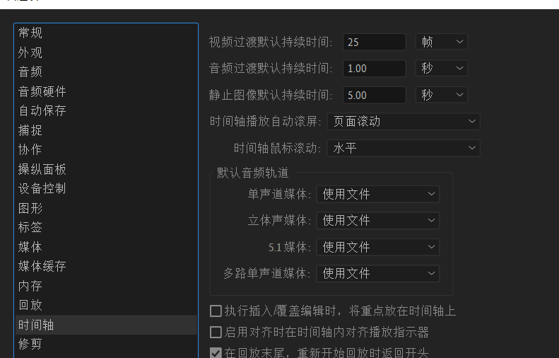

此外 Premiere Pro 可以直接导入 psd 文件，此时

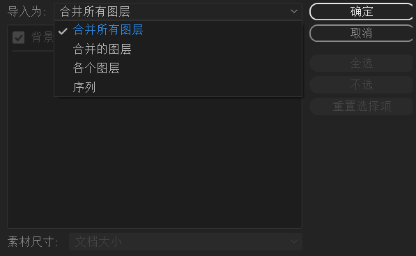

#### 批量导入素材

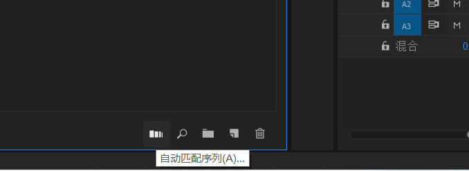

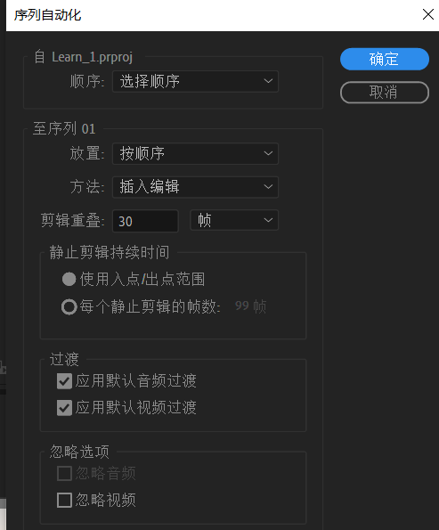

### 移动素材在时间轴中的位置

按住<kbd>ctrl</kbd>键拖动素材，变更后的素材原位置的素材会被放在后面而不会被覆盖

### 源中的插入与覆盖

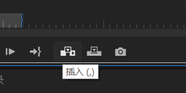

插入，即将源素材插入到时间轴现在的位置，之前存在的素材将后移

覆盖则直接替换掉原有的素材

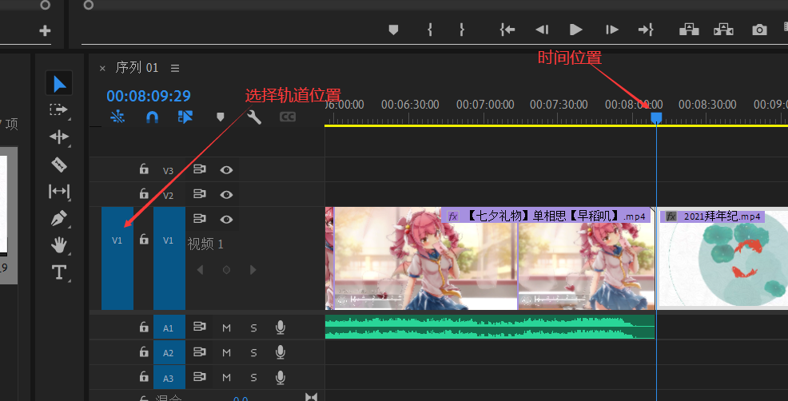

### 操作时的插入与覆盖之分

一般来说，移动/导入素材时默认是`覆盖`，按下<kbd>ctrl</kbd>可以切换到`插入`

### 提升

### 提取

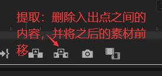

### 时间轴内的预览

#### 视频头缩略图

默认情况下时间轴内为只预览视频头，如图：

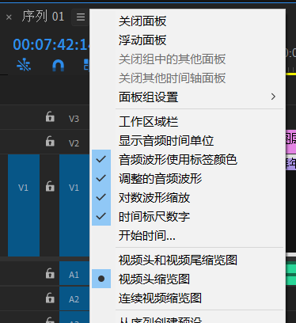

效果如下：（需要拉宽对应轨道）

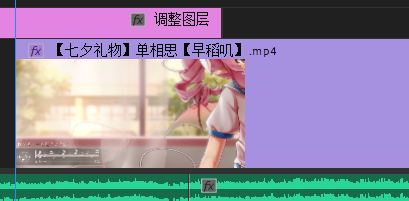

#### 连续视频缩略图

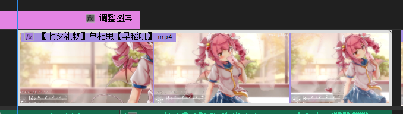

### 子剪辑

#### 创建

子剪辑，即可以将素材的出点和入点间的内容及预设保存在素材箱中，以供以后使用。操作方式为指定出入点后，在源视图床拖动视频画面到素材箱。

须注意：该操作并没有创建新的视频文件，只是保留了相关的信息

若按住 <kbd>ctrl</kbd>拖动，或者右键源监视器，选择`制作子剪辑`，可以在保存时重命名文件，图标上也有更好的标识。

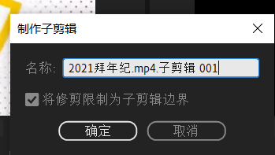

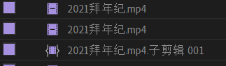

##### 修剪？

如果进行修剪，素材在导入序列后将会显示一个小三角

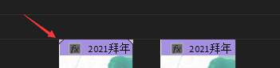

此外，这种素材将**不能延长时间长度**！

#### 编辑

右键子剪辑-编辑子剪辑，可以查看相关信息

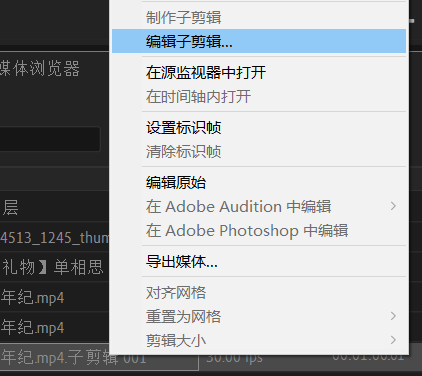

也可以将其转化为源剪辑（主剪辑）

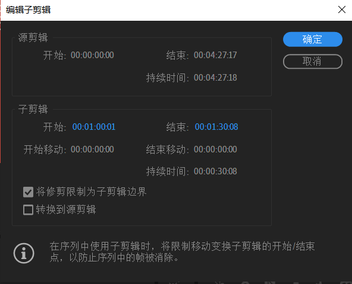

### 标记

标记用于在素材较多时标记位置或关键信息，可以标记到素材上，也可以标记到时间轴上。

快捷键:

+ 添加标记：<kbd>m</kbd>
+ 删除标记：<kbd>Ctrl + Alt+m</kbd>
+ 删除所有标记：<kbd>Ctrl + Alt + Shift + m</kbd>

所有的标记都会在标记面板中显示

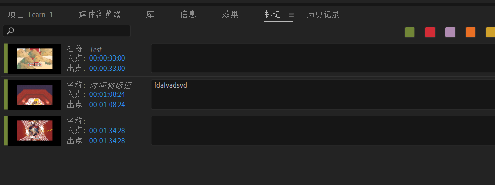

标记可以是一个点，也可以是一段序列，拖动图上的入点和出点的蓝色字体可以修改位置

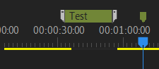

此外，在拖动时间轴时按住 <kbd>shift</kbd> 可以快速对齐一个标记

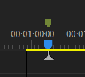

#### 时间轴

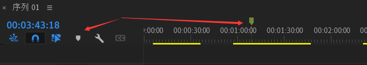

将鼠标放在上面可以显示对应内容

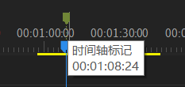

#### 素材

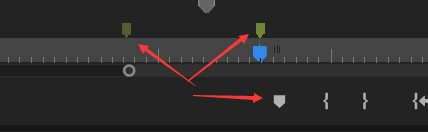

此外，在序列中也会显示素材的标记

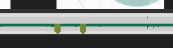

